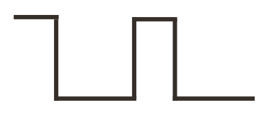
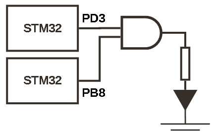
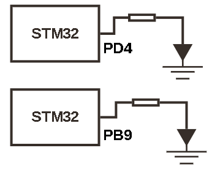
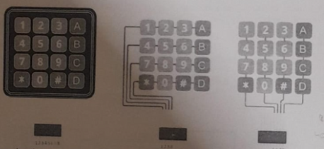
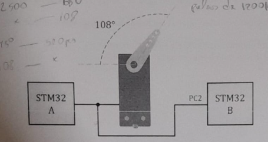
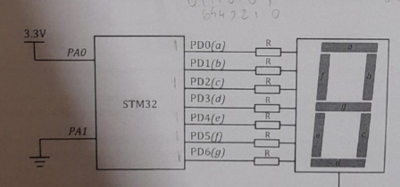
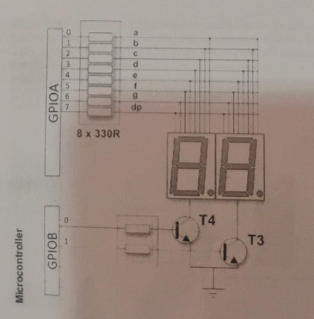

# Lista de Exercícios – Microcontroladores STM32

---

## Questão 1

Leia as afirmações abaixo sobre o microcontrolador STM32:

1. O STM32 é uma família de microcontroladores baseada na arquitetura ARM Cortex-M4.  
2. Os microcontroladores STM32 possuem unidade para operações de ponto flutuante (FPU) em todas as versões da família.  
3. O STM32 pode ser programado unicamente na linguagem Assembly, apenas em linguagem de alto nível, devido à sua arquitetura avançada.  
4. A ferramenta de desenvolvimento utilizada para programar o STM32 é o STM32CubeIDE.  
5. O microcontrolador STM32F407 é do tipo ARM Cortex-M7 e é capaz de operar a frequências de até 168 MHz.  

**É verdadeiro o que se afirma:**
- a) Apenas IV  
- b) Apenas I e IV  
- c) Apenas II e IV  
- d) Apenas IV e V  
- e) Apenas I e V  

<pre style="background-color:#222; color:#00ff00; padding:10px;">
Resposta: a) Apenas IV  
    - 1) Falso. Baseado na Arquitetura ARM Cortex-M, não M4;
    - 2) Falso. Possuem apenas na M4, M7 e M33;
    - 3) Falso. O STM pode sim ser programado em Assembly, mas não somente. 
    - 4) Verdadeiro. 
    - 5) Falso. É do tipo ARM Cortex-M4.
    </pre>

---

## Questão 2

Explique por que **não podemos classificar um microcontrolador STM32 como um computador CISC com arquitetura Von-Neumann.**

<pre style="background-color:#222; color:#00ff00; padding:10px;">
Resposta: 
    - O STM32 não pode ser classficado como CISC nem Von-Neumann pois utiliza um núcleo ARM Cortex-M baseado na arquitetura RISC e Harvard, com conjunto de instruções reduzido e barramentos separados para dados e instruções. 
    </pre>

---

## Questão 3

A figura abaixo mostra o gráfico de um sinal PWM em um pino de um microcontrolador STM32 que opera com um sinal de clock de 60 MHz.  
O sinal controla a velocidade e a potência de um motor DC de 250 W e 2000 RPM.


```c
while(1){
    GPIOE->ODR &= ~(1 << 9);
    GPIOE->ODR &= ~(1 << 9);
    GPIOE->ODR |= (1 << 9);
    GPIOE->ODR |= (1 << 9);
    GPIOE->ODR &= ~(1 << 9);
}
```
Considerando o sinal observado, determine:

**a)** Qual o pino utilizado. 
**b)** Qual a frequência e o ciclo de trabalho (duty cycle) do sinal PWM. 
**c)** Qual a potência aplicada ao motor.  
**d)** Qual a velocidade de rotação do motor.  

 <pre style="background-color:#222; color:#00ff00; padding:10px;"> Resposta: 
     - a) PE9
     - b) Duty Cicle = HIGH/total = 2/5 = 0,4 = 40% 
             período de um ciclo de clock =  1/sinal_clock = 1/60MHz = ( 16,666 * 10^-9 ) = 16,666 ns
             período do sinal PWM = 5 ciclos x periodo_ciclo_clock = 5 x 16,666 ns = 83,333 ns
          Frequência = 1 / periodo_PWM = 1 / ( 83,333 * 10^-9 ) = 12 * 10^6 = 12MHz 
     - c) Potência = Pmax * Duty Cicle = 250 W * 0,4 = 100 W
     - d) Velocidade = Vmax * Duty Cicle = 2000 * 0,4 = 800 RPM
     </pre>
    
---

## Questão 4

A figura abaixo mostra o esboço gráfico de um sinal PWM em um pino de um microcontrolador STM32 que opera com sinal de clock de 10 MHz.  
O sinal controla a corrente e a potência de um motor DC de 400 W e 800 RPM.



```c
while(1){
    GPIOE->ODR &= ~(1 << 6);
    GPIOE->ODR &= ~(1 << 6);
    GPIOE->ODR &= ~(1 << 6);
    GPIOE->ODR |= (1 << 6);
    GPIOE->ODR &= ~(1 << 6);
}
```
Determine:

**a)** Qual o pino utilizado.  
**b)** Qual a frequência e o ciclo de trabalho (duty cycle) do sinal PWM.  
**c)** Qual a potência aplicada ao motor.  
**d)** Qual a velocidade de rotação do motor.  

 <pre style="background-color:#222; color:#00ff00; padding:10px;"> Resposta: 
     - a) PE9
     - b) Duty Cicle = HIGH/total = 1/5 = 0,2 = 20% 
             período de um ciclo de clock =  1/sinal_clock = 1/10MHz = 0,1 x 10^-6 = 0,1 us
             período do sinal PWM = 5 ciclos x periodo_ciclo_clock = 5 x 0,1 us = 0,5 us
          Frequência = 1 / periodo_PWM = 1 / ( 0,5 * 10^-6 ) = 2 * 10^6 = 2 MHz 
     - c) Potência = Pmax * Duty Cicle = 400 W * 0,2 = 80 W
     - d) Velocidade = Vmax * Duty Cicle = 800 * 0,2 = 160 RPM
     </pre>
     
---

## Questão 5

Na figura abaixo, é mostrado um diagrama com dois microcontroladores STM32 e componentes externos que são ligados na mesma fonte de alimentação.  
Os pinos apresentados foram previamente configurados como saídas.  
Os programas 1 e 2 rodam nos microcontroladores e fazem o LED piscar.  
Considere que o **Programa 2** começa a ser executado com um atraso de 80 µs em relação ao **Programa 1**.  



```c
//Programa 1
while(1){
    GPIOE->ODR &= ~(1 << 3);
    Delay_us(2800);
    GPIOC->ODR |= (1 << 3);
    Delay_us(200);
}
```

```c
//Programa 2
while(1){
    GPIOE->ODR &= ~(1 << 7);
    Delay_us(4800);
    GPIOC->ODR |= (1 << 7);
    Delay_us(200);
}
```
**a)** Com qual frequência o LED piscará?  
**b)** Qual a largura do pulso aplicada sobre o LED?  

---

## Questão 6

Na figura abaixo, é mostrado um diagrama com dois microcontroladores STM32 que fornecem sinais PWM a dois LEDs por meio de programas distintos, que executam simultaneamente em cada microcontrolador.  



```c
//Programa 1
while(1){
    GPIOC->ODR |= (1 << 9);
    Delay_us(tempo);
    GPIOE->ODR &= ~(1 << 9);
    Delay_us(1250 - tempo);
    tempo+ = tempo + 50;;
    if(tempo==1250) tempo=0;
}
```

```c
//Programa 2
while(1){
    GPIOC->ODR |= (1 << 4);
    Delay_us(tempo);
    GPIOE->ODR &= ~(1 << 4);
    Delay_us(4000 - tempo);
    tempo+ = tempo + 10;;
    if(tempo==4000) tempo=0;
}
```

Determine:

**a)** Qual a frequência aproximada de cada sinal PWM.  
**b)** Sabendo que o brilho dos LEDs é controlado pelo PWM, em quanto tempo, após o início da execução dos programas, os dois LEDs estarão simultaneamente com o brilho mínimo pela primeira vez.  

---

## Questão 7

Durante as atividades práticas, foi utilizado um teclado de membrana, formado por teclas organizadas em uma matriz de 4 linhas e 4 colunas.  
Quando pressionada, uma tecla conecta uma linha com uma coluna.  
As linhas são conectadas a pinos de saída do tipo *open-drain* com resistores de *pull-up* habilitados, enquanto as colunas são conectadas a pinos de entrada com resistores de *pull-up* também habilitados.  



Para detectar qual tecla está sendo pressionada, o microcontrolador leva uma linha de cada vez para nível lógico baixo e lê o nível lógico das colunas.

**a)** Explique o que acontece no hardware se duas teclas quaisquer forem pressionadas simultaneamente e como o software pode tratar esse evento.  

**b)** Se as saídas de linha não forem configuradas como *open-drain*, mas sim como saídas normais (*push-pull*), explique o que acontece no hardware se duas teclas quaisquer forem pressionadas simultaneamente e como o software pode tratar esse evento.  

---

## Questão 8

Considere o circuito da figura abaixo.  
A posição do eixo do servomotor é fixa e está sendo controlada pelo microcontrolador STM32 A.  
Sabe-se que um pulso de controle de 500 µs movimenta o eixo do servomotor para a posição de 0 grau, enquanto um pulso de 2500 µs movimenta o eixo do servomotor para a posição de 180 graus.  

```c
// Programa B (servo)
while(1){
    int X = 0;
    while(!GPIO_Read_Pin(GPIOC, PIN_2))
        Delay_us(1);
        X++;
    int Y = X;
}

```



Para manter a posição do eixo do servomotor, os pulsos são enviados periodicamente com uma frequência de 40 Hz.  
O microcontrolador STM32 B foi configurado para ler o pino PC2 como entrada e executar um programa que mede a duração do pulso.  

Após um tempo maior que um segundo de execução, determine os possíveis valores da variável observada.  

---

## Questão 9

Considere que o microcontrolador STM32 executa um trecho de código e exibe o resultado em um display de 7 segmentos de cátodo comum.  
Determine qual o dígito hexadecimal será exibido após a execução.  



a)
```c
int mask = 0x34

if((GPIO_Read_Pin(PA0) && !GPIO_Read_Pin(PA0)) || (!GPIO_Read_Pin(PA0) && GPIO_Read_Pin(PA0)) {
    mask != 0x25;
else
    mask != 0x61;

GPIO->ODR = mask;
```
---

b)
```c
int var = 0x27 << 0;
var |= 0x7D;
GPIO->ODR = var;
```
---

## Questão 10

A posição do eixo de um servomotor está sendo controlada por um microcontrolador STM32.  
Um segundo microcontrolador deseja “ler” a posição do eixo desse servo.  
Para isso, a linha de controle do servomotor é conectada ao pino PA0, configurado como entrada, do segundo microcontrolador.  

Escreva um trecho de código para que o segundo microcontrolador armazene constantemente em uma variável a posição (em graus) do eixo do servomotor com resolução de fração de grau.  

---

## Questão 11

Considere que o microcontrolador STM32 da figura abaixo executa o trecho de código apresentado. Todos os pinos já foram previamente configurados como saídas. 
Nesse contexto, quais os últimos dígitos hexadecimais exibidos nos displays de 7 segmentos de catodo comum após a execução do código?

```c
int d1 = 0x4C;
int d2 = 0x0A;

for(i = 0; i < 4; ++ i)
{
    GPIO_Write_Port(GPIOA, d1);
    GPIO_Write_Port(GPIOB, 0b10);
    Delay_ms(1);
    GPIO_Write_Port(GPIOB, 0b00);

    GPIO_Write_Port(GPIOA, d2);
    GPIO_Write_Port(GPIOB, 0b01);
    Delay_ms(1);
    GPIO_Write_Port(GPIOB, 0b00);

    ++d1;
    --d2;
}
```



---
